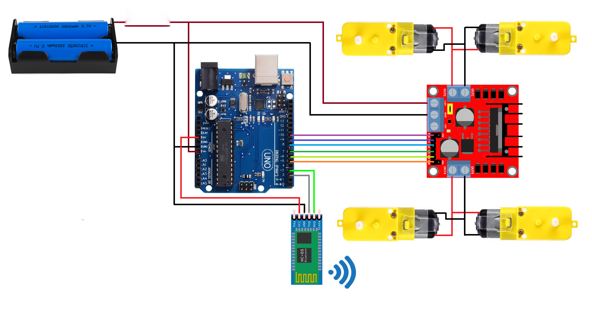
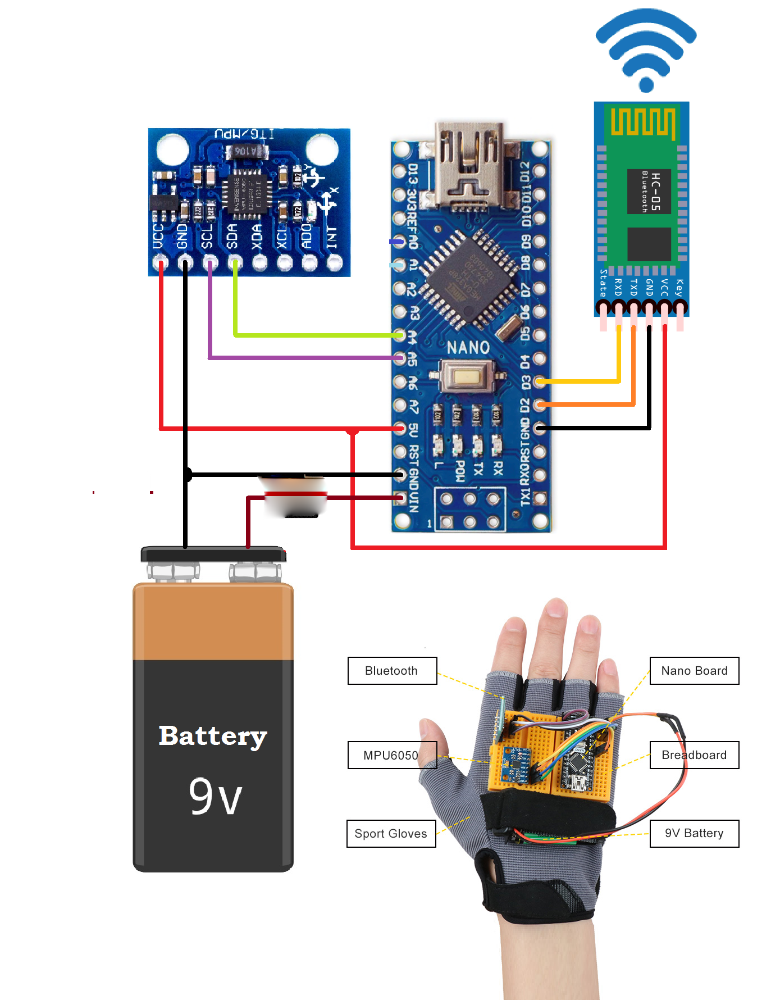

# Gesture Controlled Car

## Overview
This project implements a gesture-controlled car using Arduino Uno, Nano, Bluetooth, and an MPU6050 sensor.

## Table of Contents
1. [Features](#features)
2. [Components](#components)
3. [Setup](#setup)
4. [Installation](#installation)
5. [Usage](#usage)
6. [Contributing](#contributing)

## Features
- Gesture control for car movement.
- Wireless communication via Bluetooth.
- Real-time response to gestures.

## Components
- Arduino Uno
- Arduino Nano
- Bluetooth Modules (HC-05)
- MPU6050 sensor
- DC Motors
- Motor Driver (L298N)
- Battery Pack
- Jumper Wires and Breadboard

## Setup
### Car Circuit

### Glove Circuit

## Installation
1. **Libraries**: Install `MPU6050` and ensure `Wire` library is included.
2. **Sketches**:
   - Upload `BTCarRx.ino` to Arduino Uno.
   - Upload `BTCarTx.ino` to Arduino Nano.
3. **Bluetooth**: Pair the Bluetooth modules ,by making one as the master and another as slave.(baud rate: 9600).

## Usage
1. **Power Up**: Ensure car and glove are powered.
2. **Wear Glove**: Put on the glove with the MPU6050 sensor.
3. **Control Car**:
   - **Forward**: Tilt hand forward.
   - **Backward**: Tilt hand backward.
   - **Left**: Tilt hand left.
   - **Right**: Tilt hand right.

## Contributing
Fork the repository and submit a pull request for any improvements.

Happy Building! 🚗✋
